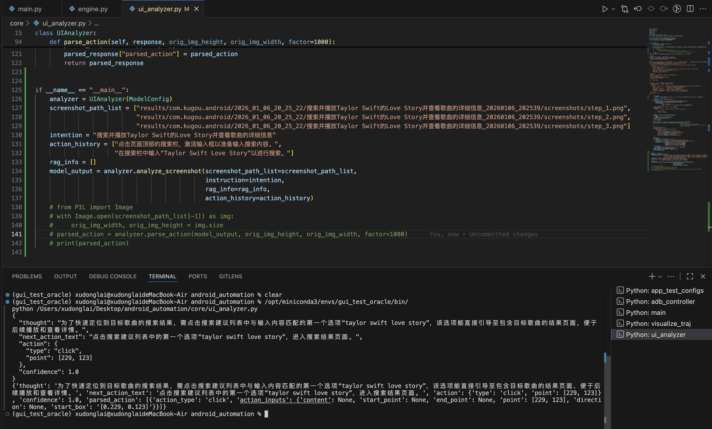

# KG-RAG-V2 Benchmark Evaluation

## Links
- apk: https://drive.google.com/drive/folders/1It1hX83IGIaGP12tV_kMwHVh-s3gVUMu?usp=sharing
- intention: https://drive.google.com/drive/folders/1ozPXt2nbKEPCQ8Zo4Hdb-WtsMawN0waI?usp=sharing
- android_automation: https://github.com/xudonglai0426/android_automation

## 测评范围
#### app
- android: 所有apk涉及的38个app
- harmony: 所有标注的5-10个app
- ios: 音乐垂类的3个app

#### model
- gpt-4o/gemini/Claude
- doubao-vision-1.6, qwen3-vl, ui-tars, ui-tars-1.5

## Inputs/Outputs:
#### Input: 
- 一批意图以及一个常用的app

#### Output: 
- 每一意图执行的app截图序列以及相关信息

#### Examples:
intention: 搜索并播放Taylor Swift的Love Story，并查看歌曲的详细信息

app: 酷狗音乐

输入文件：
```json（input）
{
    "intent_1": {
        "intention": "搜索并播放Taylor Swift的Love Story，并查看歌曲的详细信息",
        "action_desp_list": ["点击搜索框", "输入Taylor Swift Love Story", "点击搜索按钮", "点击搜索结果中第一个歌曲",
      "向左滑动", "向左滑动"],
        "checkpoint_list": ["搜索结果页面", "歌曲播放页面", "歌曲详情信息页"],
        "bounding_box_list": [[44, 272, 844, 357], [], [951, 160, 1050, 214], [174, 996, 1058, 1121], [], []],
        "image_path_list": ["intent_1/step_001.png", "intent_1/step_002.png", "intent_1/step_003.png",
        "intent_1/step_004.png", "intent_1/step_005.png", "intent_1/step_006.png", "intent_1/step_007.png"],
        "rag_info": [
            {
                "id": "26",
                "intention": "搜索并播放歌曲后深入了解其创作背景",
                "sub_intention_list": [
                    "进入歌曲播放页面",
                    "进行搜索操作",
                    "进入歌曲播放页面",
                    "查看歌曲详情信息",
                    "查看歌曲制作信息"
                ],
                "score": 0.9106649160385132
            },
            {
                "id": "132",
                "intention": "探索歌曲详情并播放音乐",
                "sub_intention_list": [
                    "进入歌曲播放页面",
                    "进行搜索操作",
                    "进入歌曲播放页面",
                    "查看歌曲详情信息",
                    "查看推荐歌单内容"
                ],
                "score": 0.9002076983451843
            },
            {
                "id": "68",
                "intention": "搜索并播放特定歌曲后深入了解相关歌手",
                "sub_intention_list": [
                    "进入歌曲播放页面",
                    "进行搜索操作",
                    "进入歌曲播放页面",
                    "查看歌手详情信息",
                    "关注歌手",
                    "查看艺人个人主页",
                    "查看活动页面信息"
                ],
                "score": 0.8951131701469421
            },
            {
                "id": "158",
                "intention": "通过播放页面探索歌曲所属专辑并查看专辑详情",
                "sub_intention_list": [
                    "进入歌曲播放页面",
                    "查看歌曲详情信息",
                    "查看专辑详情信息"
                ],
                "score": 0.8934696316719055
            },
            {
                "id": "0",
                "intention": "搜索并播放特定歌曲后查看其综合信息",
                "sub_intention_list": [
                    "进入歌曲播放页面",
                    "进行搜索操作",
                    "进入歌曲详细播放页面",
                    "查看歌曲详情信息",
                    "查看歌曲指数数据"
                ],
                "score": 0.8924832344055176
            }
        ]
    },
    "intent_2": ...
}
```
<div align="center">
    
</div>

输出文件(hdc/android自动生成，ios需要手动填写h：
```
app_package/  
 └── intent_datetime/  
     ├── screenshots/  
     │   ├── step_1.png  
     │   ├── step_2.png  
     │   └── ...  
     ├── traj.json/  
     └── execution.log  
```
app_package: qq音乐
intent_datetime: 搜索一首歌并播放_20260108

traj.json:
```json（output）
{
  "trajectory": [
    {
      "step_number": 1,
      "screenshot": "screenshots/results/com.kugou.android/2025_12_16_15_33_14/查看个人收藏夹的信息_20251216_154811/screenshots/step_1.png",
      "action": {   ## 调用UIAnalyzer.analyze_screenshot直接生成
        "thought": "要查看个人收藏夹信息，需先进入个人中心页面。当前页面底部导航栏最右侧为“我的”按钮，点击该按钮可进入个人中心，进而找到收藏夹入口。",
        "next_action_text": "点击页面底部导航栏最右侧的“我的”图标，进入个人中心页面。",
        "action": "click(point='<point>900 910</point>')",
        "confidence": 0.95,
        "parsed_action": [   ## 调用UIAnalyzer.parsed_action直接生成
          {
            "reflection": null,
            "thought": null,
            "action_type": "click",
            "action_inputs": {
              "start_box": "[0.9, 0.91, 0.9, 0.91]"
            },
            "text": "click(start_box='(900,910)')"
          }
        ]
      }
    },
    {
        "step_number": 2,
        ...
    },
...
  ]
}
```

## Notes
- android app 通过apk安装，harmony/ios直接在应用市场安装就行
- android/harmony 可以通过android automation自动化执行，ios需要人工操作手机

## Harmony
#### Hdc
Harmony涉及hdc的安装（作用与adb一致）

下载地址：https://developer.huawei.com/consumer/cn/download/  安装Command Line Tools 6.0.1 Release

之后配置环境变量 export PATH=$PATH:/Users/xudonglai/Desktop/command-line-tools/sdk/default/openharmony/toolchains（可参考：https://developer.huawei.com/consumer/cn/doc/harmonyos-guides/hdc ）

安装成功的标志是，连接Harmony手机的情况下，在terminal运行 hdc list targets 显示对应手机的sn号
```python
(base) xudonglai@xudonglaideMacBook-Air ~ % hdc list targets
9CN0223B01031784
```

#### 测评
详见android_automation

## Android
#### Apk
包含所有需要的android app的apk安装包
https://drive.google.com/drive/folders/1p-mkBJfkHjhZYqziaU5YYDhSoGCqHnRJ?usp=sharing

在虚拟机上，在terminal可通过adb install /Users/name/Downloads/xxx.apk (具体apk路径) 直接安装

#### Android studio/Adb

需要安装Android studio以及adb，以使用安卓虚拟机

Android Studio: https://developer.android.com/studio?hl=zh-cn

一直点击next，应该会自动安装adb，第一次安装耗时会久一些（安装中如果有问题，可以直接搜索/gpt，相关内容很多）

安装成功后，Android Studio → More Actions → Virtual Device Manager
<div align="center">
  
</div>

在里边添加新的模拟机，选择 Pixel 6机型
<div align="center">
  
</div>

添加成功后，对应的device name会显示在界面上
<div align="center">
  
</div>


启动虚拟机，所有一切都安装成功的标志就是，在terminal运行 adb devices 命令时，显示对应的虚拟机的id（证明adb可以正常连接到手机并使用）
```python
List of devices attached
emulator-5554   device
```

#### 测评
详见android_automation

## IOS

#### XnViewMP（用于坐标点确认）

Windows/Mac系统都可以下载安装XnViewMP，用免费版即可

用XnViewMP打开图片，移动光标就可以在右下角找到对应X,Y坐标

<div align="center">
<p align="center">
  
</p>
</div>

#### 测评
因为ios无法像harmony/android进行自动化测评，需要人工拼接模型输入、获取模型输出以及操作手机

主要方式为，运行android_automation中 core.ui_analyzer.py函数

<div align="center">
<p align="center">
  
</p>
</div>


1. 填写参数（intention：测试意图，screenshot_path_list：历史执行截图序列（包含当前页面），action_history：历史操作序列，rag_info：rag知识）
   - 填入intention
   - 获取当前手机的截图的本地路径，填入screenshot_path_list
   - 获取上一步模型输出中的“next_action_text”字段，填入action_history（如果为第一步，则action_history=[]）
   - 获取rag知识填入rag_info（rag知识是测试意图维度的，每个测试意图对应一段rag知识，没有则rag_info=[]）
 
2. 运行函数 analyze_screenshot, 获取模型输出
3. 根据模型输出，去进行操作（如：[229, 123] 就是点击图片上 x 为229，y 为123的点，可以用XnViewMP移动光标来获取截图上的坐标点）
```json
{
  "thought": "为了快速定位到目标歌曲的搜索结果，需点击搜索建议列表中与输入内容匹配的第一个选项“taylor swift love story”，该选项能直接引导至包含目标歌曲的结果页面，便于后续播放和查看详情。",
  "next_action_text": "点击搜索建议列表中的第一个选项“taylor swift love story”，进入搜索结果页面。",
  "action": {
    "type": "click",
    "point": [229, 123]
  },
  "confidence": 1.0
}
```
   
